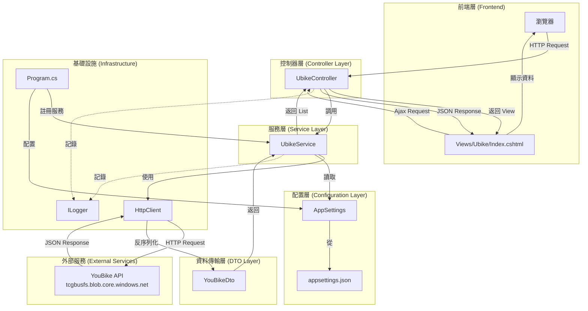
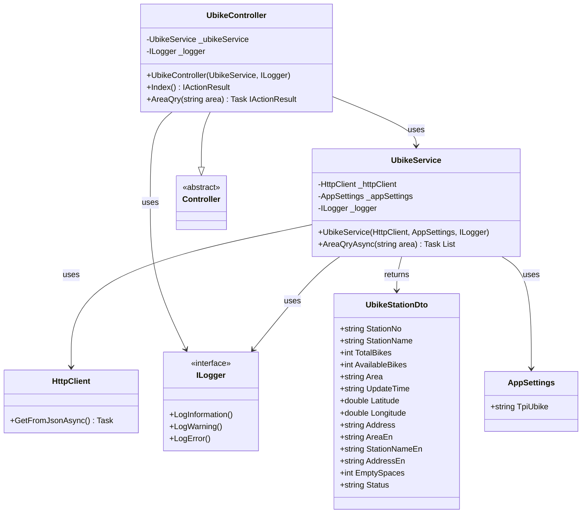
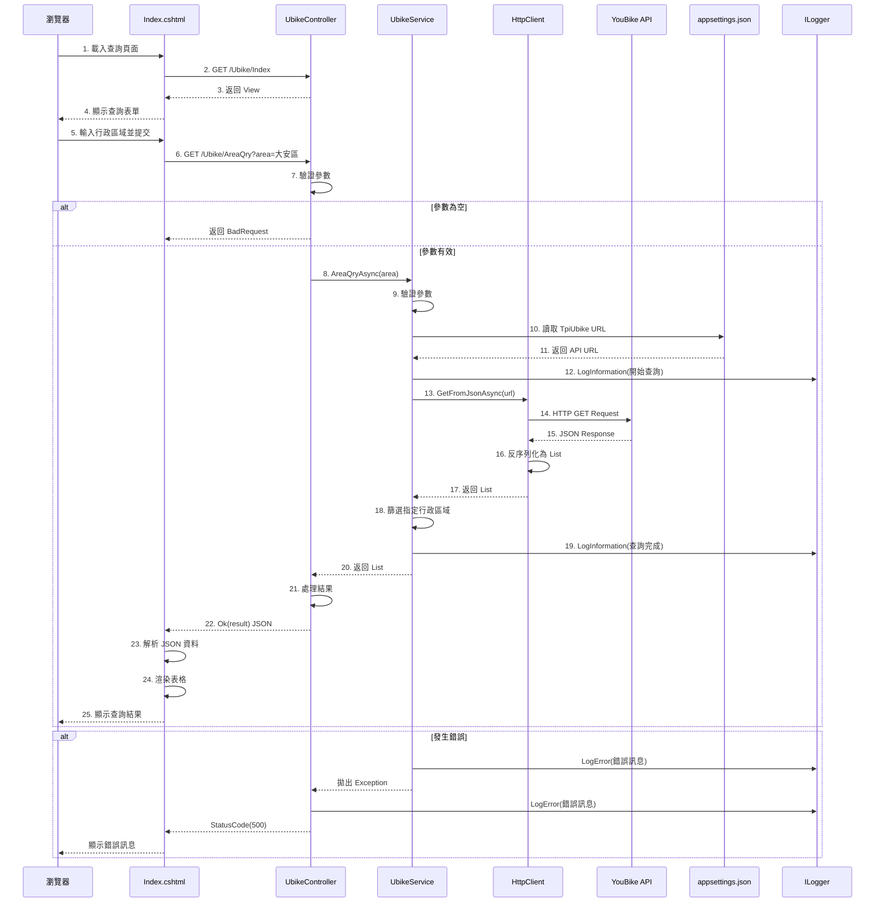
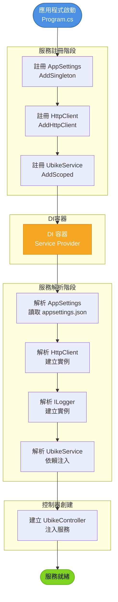
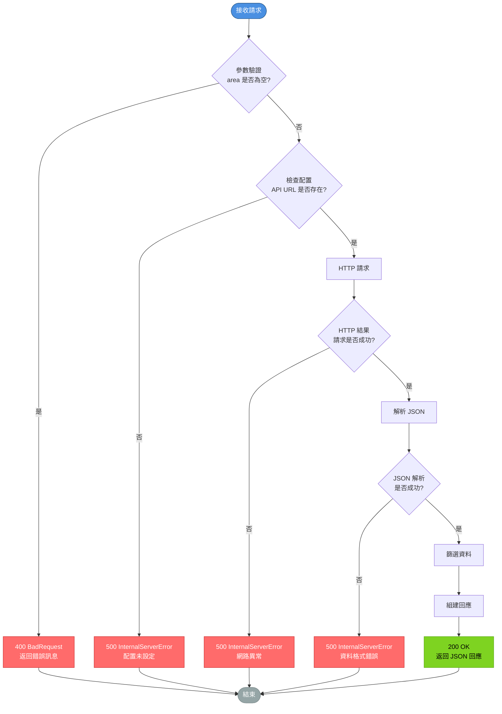

# UbikeController 架構圖表集

## 系統架構圖

```mermaid
graph TB
subgraph "前端層 (Frontend)"
Browser[瀏覽器]
View[Views/Ubike/Index.cshtml]
end

subgraph "控制器層 (Controller Layer)"
UbikeController[UbikeController]
end

subgraph "服務層 (Service Layer)"
UbikeService[UbikeService]
end

subgraph "資料傳輸層 (DTO Layer)"
YouBikeDto[YouBikeDto]
end

subgraph "配置層 (Configuration Layer)"
AppSettings[AppSettings]
ConfigFile[appsettings.json]
end

subgraph "外部服務 (External Services)"
YouBikeAPI[YouBike API\ntcgbusfs.blob.core.windows.net]
end

subgraph "基礎設施 (Infrastructure)"
HttpClient[HttpClient]
Logger[ILogger]
Program[Program.cs]
end

Browser -->|HTTP Request| UbikeController
UbikeController -->|返回 View| View
View -->|Ajax Request| UbikeController
UbikeController -->|調用| UbikeService
UbikeService -->|使用| HttpClient
UbikeService -->|讀取| AppSettings
AppSettings -->|從| ConfigFile
HttpClient -->|HTTP Request| YouBikeAPI
YouBikeAPI -->|JSON Response| HttpClient
HttpClient -->|反序列化| YouBikeDto
YouBikeDto -->|返回| UbikeService
UbikeService -->|返回 List| UbikeController
UbikeController -->|JSON Response| View
View -->|顯示資料| Browser
UbikeService -.->|記錄| Logger
UbikeController -.->|記錄| Logger
Program -->|註冊服務| UbikeService
Program -->|配置| AppSettings
```

## 類別關係圖

```mermaid
classDiagram
class UbikeController {
-UbikeService _ubikeService
-ILogger _logger
+UbikeController(UbikeService, ILogger)
+Index() IActionResult
+AreaQry(string area) Task IActionResult
}

class UbikeService {
-HttpClient _httpClient
-AppSettings _appSettings
-ILogger _logger
+UbikeService(HttpClient, AppSettings, ILogger)
+AreaQryAsync(string area) Task List
}

class UbikeStationDto {
+string StationNo
+string StationName
+int TotalBikes
+int AvailableBikes
+string Area
+string UpdateTime
+double Latitude
+double Longitude
+string Address
+string AreaEn
+string StationNameEn
+string AddressEn
+int EmptySpaces
+string Status
}

class AppSettings {
+string TpiUbike
}

class Controller {
<<abstract>>
}

class ILogger {
<<interface>>
+LogInformation()
+LogWarning()
+LogError()
}

class HttpClient {
+GetFromJsonAsync() Task
}

UbikeController --|> Controller
UbikeController --> UbikeService : uses
UbikeController --> ILogger : uses
UbikeService --> HttpClient : uses
UbikeService --> ILogger : uses
UbikeService --> UbikeStationDto : returns
UbikeService --> AppSettings : uses
```

## 序列圖

```mermaid
sequenceDiagram
participant Browser as 瀏覽器
participant View as Index.cshtml
participant Controller as UbikeController
participant Service as UbikeService
participant HttpClient as HttpClient
participant API as YouBike API
participant Config as appsettings.json
participant Logger as ILogger

Browser->>View: 1. 載入查詢頁面
View->>Controller: 2. GET /Ubike/Index
Controller-->>View: 3. 返回 View
View-->>Browser: 4. 顯示查詢表單

Browser->>View: 5. 輸入行政區域並提交
View->>Controller: 6. GET /Ubike/AreaQry?area=大安區
Controller->>Controller: 7. 驗證參數

alt 參數為空
Controller-->>View: 返回 BadRequest
else 參數有效
Controller->>Service: 8. AreaQryAsync(area)
Service->>Service: 9. 驗證參數
Service->>Config: 10. 讀取 TpiUbike URL
Config-->>Service: 11. 返回 API URL
Service->>Logger: 12. LogInformation(開始查詢)
Service->>HttpClient: 13. GetFromJsonAsync(url)
HttpClient->>API: 14. HTTP GET Request
API-->>HttpClient: 15. JSON Response
HttpClient->>HttpClient: 16. 反序列化為 List
HttpClient-->>Service: 17. 返回 List

Service->>Service: 18. 篩選指定行政區域
Service->>Logger: 19. LogInformation(查詢完成)
Service-->>Controller: 20. 返回 List
Controller->>Controller: 21. 處理結果
Controller-->>View: 22. Ok(result) JSON
View->>View: 23. 解析 JSON 資料
View->>View: 24. 渲染表格
View-->>Browser: 25. 顯示查詢結果
end

alt 發生錯誤
Service->>Logger: LogError(錯誤訊息)
Service-->>Controller: 拋出 Exception
Controller->>Logger: LogError(錯誤訊息)
Controller-->>View: StatusCode(500)
View-->>Browser: 顯示錯誤訊息
end
```

## 資料流程圖

```mermaid
flowchart LR
subgraph DS[資料來源]
API[YouBike API<br/>JSON 資料]
end

subgraph HTTP[HTTP 層]
REQ[HTTP 請求<br/>GetFromJsonAsync]
RESP[HTTP 回應<br/>JSON 字串]
end

subgraph PROC[資料處理]
DESER[JSON 反序列化<br/>JsonSerializer]
DTOLIST[List YouBikeDto<br/>反序列化結果]
end

subgraph LOGIC[業務邏輯]
FILTER[按地區篩選<br/>Where Area == area]
FILTERED[List YouBikeDto<br/>篩選結果]
end

subgraph BUILD[回應組建]
BUILD_STEP[組建回應]
RESP_DTO[YouBikeDto List<br/>Area, Count]
end

subgraph RET[返回結果]
CTRL[Controller<br/>Ok result]
CLIENT[Client<br/>JSON 回應]
end

API -->|1. HTTP GET| REQ
REQ -->|2. JSON 字串| RESP
RESP -->|3. 反序列化| DESER
DESER -->|4. DTO列表| DTOLIST
DTOLIST -->|5. 篩選| FILTER
FILTER -->|6. 篩選結果| FILTERED
FILTERED -->|7. 組建| BUILD_STEP
BUILD_STEP -->|8. 回應DTO| RESP_DTO
RESP_DTO -->|9. 傳遞| CTRL
CTRL -->|10. HTTP 回應| CLIENT
```

## 依賴注入流程圖

```mermaid
flowchart TD
Start([應用程式啟動<br/>Program.cs])

subgraph REG[服務註冊階段]
REG_AS[註冊 AppSettings<br/>AddSingleton]
REG_HC[註冊 HttpClient<br/>AddHttpClient]
REG_SVC[註冊 UbikeService<br/>AddScoped]
end

subgraph DIC[DI容器]
CONTAINER[DI 容器<br/>Service Provider]
end

subgraph RESOLVE[服務解析階段]
RES_AS[解析 AppSettings<br/>讀取 appsettings.json]
RES_HC[解析 HttpClient<br/>建立實例]
RES_LOG[解析 ILogger<br/>建立實例]
RES_SVC[解析 UbikeService<br/>依賴注入]
end

subgraph CTR[控制器創建]
CREATE_CTR[建立 UbikeController<br/>注入服務]
end

Start --> REG_AS
REG_AS --> REG_HC
REG_HC --> REG_SVC
REG_SVC --> CONTAINER

CONTAINER --> RES_AS
RES_AS --> RES_HC
RES_HC --> RES_LOG
RES_LOG --> RES_SVC

RES_SVC --> CREATE_CTR
CREATE_CTR --> End([服務就緒])

style Start fill:#4A90E2,stroke:#2E5C8A,color:#fff
style CONTAINER fill:#F5A623,stroke:#D68910,color:#fff
style End fill:#7ED321,stroke:#5BA617,color:#000
```

## 錯誤處理流程圖

```mermaid
flowchart TD
Start([接收請求]) --> Validate{參數驗證<br/>area 是否為空?}

Validate -->|是| Error1[400 BadRequest<br/>返回錯誤訊息]
Validate -->|否| CheckConfig{檢查配置<br/>API URL 是否存在?}

CheckConfig -->|否| Error2[500 InternalServerError<br/>配置未設定]
CheckConfig -->|是| HTTPRequest[HTTP 請求]

HTTPRequest --> HTTPResult{HTTP 結果<br/>請求是否成功?}
HTTPResult -->|否| Error3[500 InternalServerError<br/>網路異常]
HTTPResult -->|是| ParseJSON[解析 JSON]

ParseJSON --> ParseResult{JSON 解析<br/>是否成功?}
ParseResult -->|否| Error4[500 InternalServerError<br/>資料格式錯誤]
ParseResult -->|是| Filter[篩選資料]

Filter --> BuildResponse[組建回應]
BuildResponse --> Success[200 OK<br/>返回 JSON 回應]

Error1 --> End([結束])
Error2 --> End
Error3 --> End
Error4 --> End
Success --> End

style Start fill:#4A90E2,stroke:#2E5C8A,color:#fff
style Success fill:#7ED321,stroke:#5BA617,color:#000
style Error1 fill:#FF6B6B,stroke:#C92A2A,color:#fff
style Error2 fill:#FF6B6B,stroke:#C92A2A,color:#fff
style Error3 fill:#FF6B6B,stroke:#C92A2A,color:#fff
style Error4 fill:#FF6B6B,stroke:#C92A2A,color:#fff
style End fill:#95A5A6,stroke:#7F8C8D,color:#fff
```
